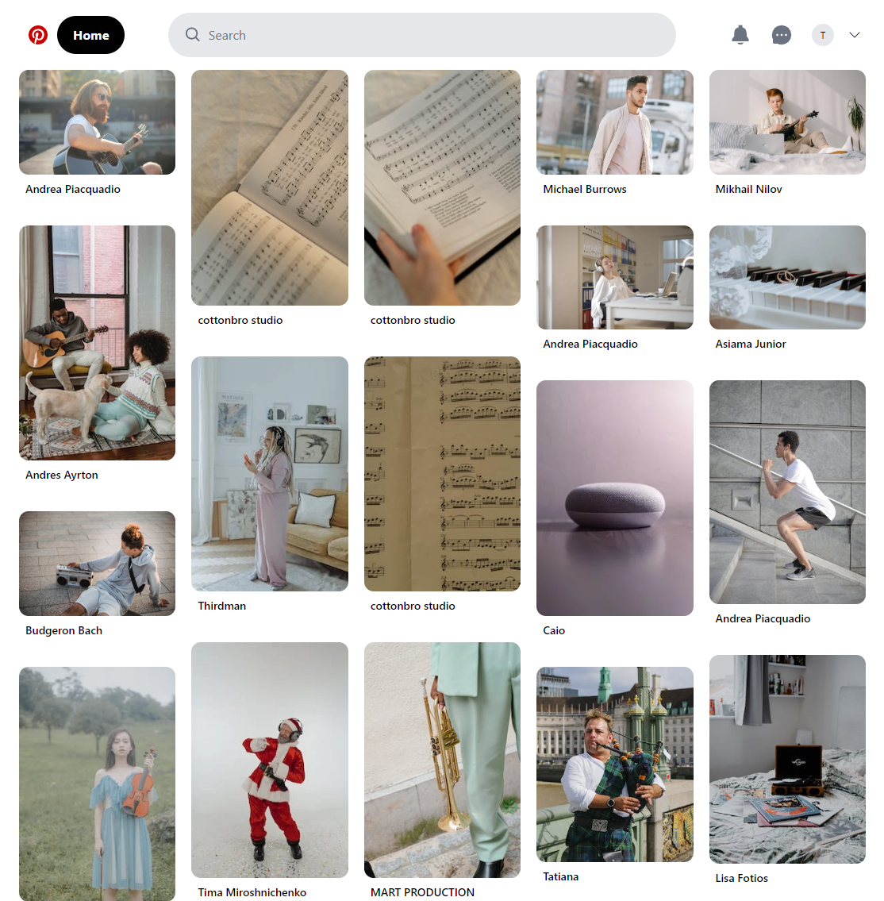

# Pinterest Clone

A high-performance application to discover new ideas by browsing an infinite scroll interface.

## Preview

[Link](https://pinterest-clon.netlify.app/)

## Getting Started

1. Clone this project
2. Go to project's folder
3. Install dependencies `npm install`
4. Make sure you have the env vars (check `.env.example`)
5. Run and have fun ;) `npm run dev`

## Scripts

- `npm run dev` to development environment
- `npm run build` && `npm run preview` to production

## Technologies

- React
- TypeScript
- Vitejs
- TailwindCSS

## API documentation

[Pexels API](https://www.pexels.com/api/)

## License

MIT
